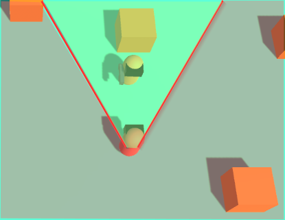
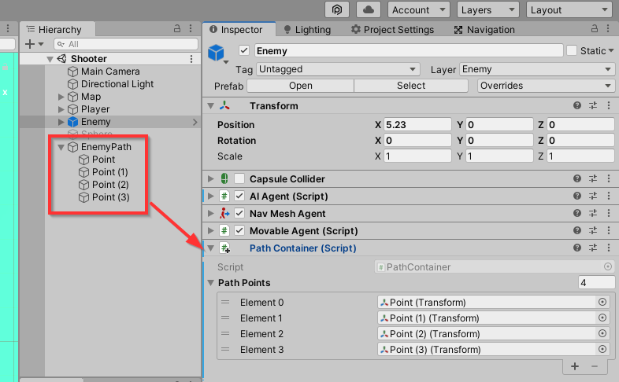

# Clase #7

## Contenido

- Pathfinding y Algoritmo A*
  - Unity NavMesh.
- Inteligencia artificial en videojuegos
  - Finite-state machine y alternativas
  - Enemigo básico: Idle - Chase - Attack

## Taller

### Fecha de entrega
> Viernes 26 de Noviembre - 11:59 pm (media noche del viernes).

### Descripción
**Parte 1: Chease solo cuando el playe resta al frente**
- En el script `AIAgent`, actualizar la función `IsLookingTarget` ([AIAgent.43](https://github.com/UNAL-IntroVideojuegos-2021-2/intro-videogames-2021-2/blob/093764511582c4ccf19f6ce3c845461c02f6767c/Unity/intro-videojuegos-app-2021-2/Assets/Scr/AI/AIAgent.cs#L43)) para que devuelva `true` solo cuando el target este en frente del enemigo. Hint: usar producto cruz (Dot product)).
  - Note que el script `AIIdleState` ya hace uso de esta función `IsLookingTarget` ([AIIdleState.Update](https://github.com/UNAL-IntroVideojuegos-2021-2/intro-videogames-2021-2/blob/093764511582c4ccf19f6ce3c845461c02f6767c/Unity/intro-videojuegos-app-2021-2/Assets/Scr/AI/States/AIIdleState.cs#L29)).
    
    
**Reto (Opcional)**
- Hacer que la función `IsLookingTarget` devuelva true si el target esta en cono de visión.
  

**Parte 2: Character Controller**
- Implemente el estado de `Patrol`: recorrer un una secuencia de puntos en orden.
- Agregue un timer al estado `Idle` ([AIIdleState.19](https://github.com/UNAL-IntroVideojuegos-2021-2/intro-videogames-2021-2/blob/093764511582c4ccf19f6ce3c845461c02f6767c/Unity/intro-videojuegos-app-2021-2/Assets/Scr/AI/States/AIIdleState.cs#L19)) para que, despues de X segundos, cambia al estado de `Patrol`.

**Anotaciones**: Lo siguiente ya existe en el código. No tiene que crear nada de esto, solo debe implementar la lógica del estado `Patrol`.
- Note que hay un nuevo estado llamado Patrol:
  - Se creó el script `AIPatrolState` ([AIPatrolState.cs](https://github.com/UNAL-IntroVideojuegos-2021-2/intro-videogames-2021-2/blob/093764511582c4ccf19f6ce3c845461c02f6767c/Unity/intro-videojuegos-app-2021-2/Assets/Scr/AI/States/AIPatrolState.cs#L1)).
  - Se agregó el valor `Patrol` al enum `AIStateID` ([AIState.cs](https://github.com/UNAL-IntroVideojuegos-2021-2/intro-videogames-2021-2/blob/093764511582c4ccf19f6ce3c845461c02f6767c/Unity/intro-videojuegos-app-2021-2/Assets/Scr/AI/AIState.cs#L6)).
  - Este estado ya esta siendo agregado al `stateMachine` de nuestro enemigo (revisar [AIAgent.Start](https://github.com/UNAL-IntroVideojuegos-2021-2/intro-videogames-2021-2/blob/093764511582c4ccf19f6ce3c845461c02f6767c/Unity/intro-videojuegos-app-2021-2/Assets/Scr/AI/AIAgent.cs#L32)).
- Note que el enemigo tiene un nuevo componente llamado `PathContainer`([PathContainer.cs](https://github.com/UNAL-IntroVideojuegos-2021-2/intro-videogames-2021-2/blob/093764511582c4ccf19f6ce3c845461c02f6767c/Unity/intro-videojuegos-app-2021-2/Assets/Scr/AI/PathContainer.cs#L5)) que contiene los puntos en la escena que conforman el path a recorrer.
  - Utilice este componente para obtener el siguiente punto del camino al que debe ir.
  
  

### Entrega
- Crear una branch a partir del branch `session/session-7`.
  - El nombre de la nueva branch debe tener el siguiente formato: `student/[usuario-unal]/session-7`
```
 Ejemplo: Si su correo es pedrito@unal.edu.co, la rama para hacer la entrega de la clase 7 debe ser `student/pedrito/session-7`.
```
- Hacer los commits necesarios para efectuar la solución al taller.
- Hacer un Pull Request de su branch (`student/[usuario-unal]/session-7`)
  - La branch target del PR debe ser `session/session-7`.
  - El nombre del PR debe seguir el formato `Solución Taller Clase 7 by [usuario-unal]`. 
```
 Ejemplo: Si su correo es pedrito@unal.edu.co, el título del PR debe ser: `Solución Taller Clase 7 by pedrito`.
```
  - La descripción del PR puede ser usada para dejar notas, aclaraciones, preguntas, etc. También se puede dejar vacio.

### Nota
No dude en buscar recursos (YouTube, tutoriales, foros, etc.) y revisar la documentación oficial de Unity para la ejecución del taller.
No dude en escribirnos con cualquier duda, sugerencia, comentario que tenga!